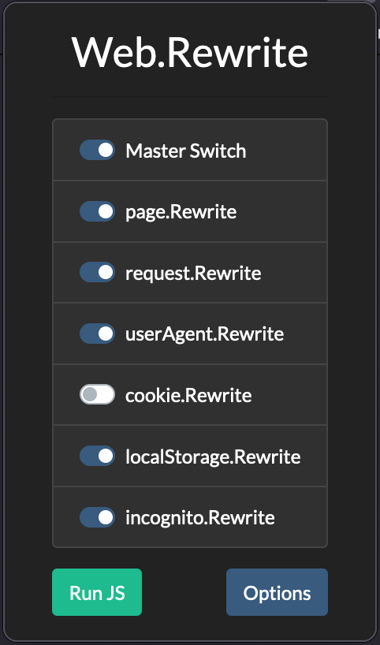
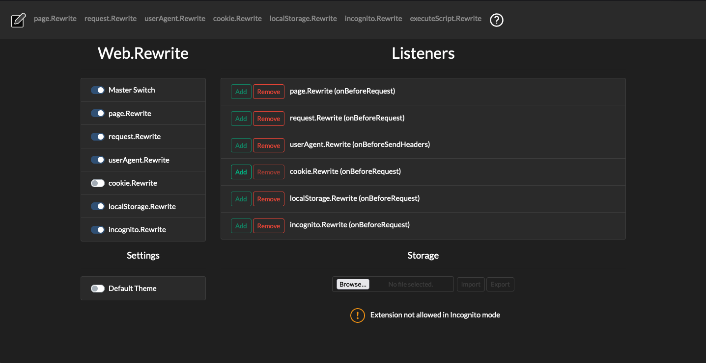
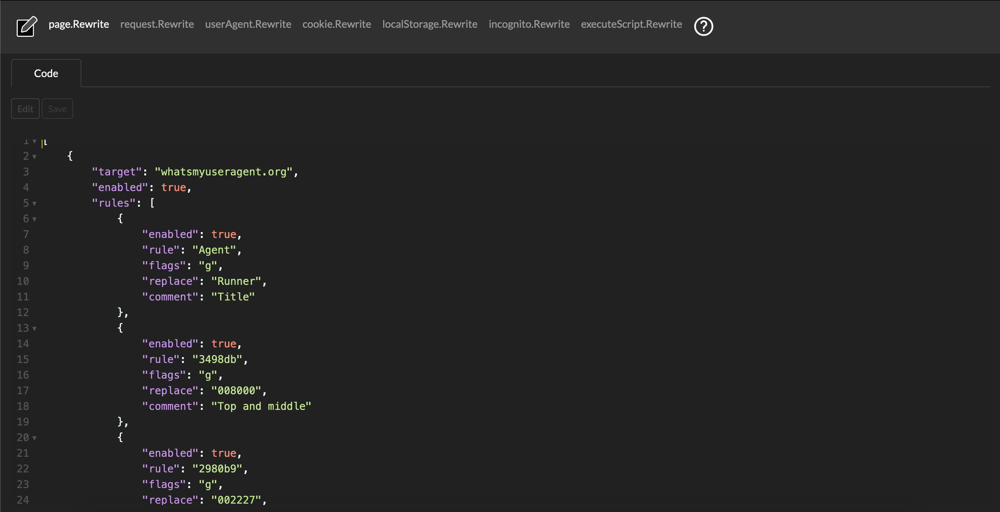

# Web.Rewrite

Web.Rewrite is a web request and response interceptor in a browser extension that uses Javascript regex and user-created functions to modify content in real time. This content includes main_frame, script, stylesheet, xmlhttprequest and websocket.

## Why?

Although [uMatrix](https://github.com/gorhill/uMatrix), [uBlock](https://github.com/gorhill/uBlock) and [NoScript](https://github.com/hackademix/noscript/) are great tools, unfortunately they cannot stop all the bullshit going around on the Internet.

Some websites:
- Use objects, frames or CSS that interfere with users reading the content
- Display pictures in a smaller div while the file is actually larger and is being downloaded anyway
- Display the page according to user web agent
- Display too many ads
- Display those annoying cookie consent banners
- Use randomised id strings to stop you from creating persistent rules
- Automatically refresh a webpage (sending another XHR that will download more junk)
- Use JS to enforce client-based (?!) security controls, authentication and paywalls
- Many other techniques that may invade your privacy or ruin your experience and waste your time

### Burp can do almost all of it

Yes, you can always proxy your requests through Burp (Proxy - Options - Match and Replace), although you would need an extension to play with cookies, local storage and save JS one-liners to run once.

With this extension you can also:
- Create rules for several targets;
- Create rules for Local Storage;
- Create rules for Cookies;
- Automate their processing without an additional tool running in the background;
- Switches make it easy to turn rules on/off;
- Export them to backup files;
- Export and import them in other devices;
- Share the rules with regular users;
- Expand and improve the features because it is open source

## Target audience

- Advanced users looking for automated ways to modify web request and responses with dynamic content
- Advanced users looking to block selected inline JS code
- Application Security Engineers, Product Security Engineers and Pentesters looking to bypass JS paywalls and authentication

## Installation

If you download the `webrewrite-[version]-fx.xpi` file from the `web-ext-artifacts` folder, you can install according to the following instructions:

[https://extensionworkshop.com/documentation/publish/distribute-sideloading/#install-addon-from-file](https://extensionworkshop.com/documentation/publish/distribute-sideloading/#install-addon-from-file)

You will need the [example config file](https://github.com/mmartins000/WebRewrite/blob/master/resources/example_config.json5) in the Github repo. For more information, check [CONFIG.md](https://github.com/mmartins000/WebRewrite/blob/master/CONFIG.md) file.

## Configuration

- Click on the extension icon
- Create regex rules to replace HTML/CSS/JS code as you like
- You can test your regex rules on any online regex tester (check the help tab in the Options page for some of them)

The following sections contain a brief explanation of the functionalities. For the details, please check [CONFIG.md](https://github.com/mmartins000/WebRewrite/blob/master/resources/example_config.json5).

### page.Rewrite

Intercepts and changes/adds/removes values from web responses on-the-fly using RegEx.

### request.Rewrite

Intercepts and changes/adds/removes values from web requests (URL and POST data) on-the-fly using RegEx.

### userAgent.Rewrite

Intercepts and changes the user agent string from web requests on-the-fly.

### cookie.Rewrite

Adds/updates or removes cookies (key/value pairs). 

### localStorage.Rewrite

Adds/updates or removes variables from Local Storage (key/value pairs).

### executeScript.Rewrite

Runs JavaScript code for all open websites, not only for the active tab. Executed only when button `Run JS` is the Popup windows is used.

## Regular use

- Enable the extension in the web browser
- Refresh the page (if it does not work, try opening the same url in a new tab)
- Web.Rewrite will automatically process the rules, intercept web requests and responses and make the changes

## One-time use

- Enable the extension in the web browser
- To run specific rules (JavaScript code) at any given time, hit the button "Run JS" in the popup window
- Enabled rules in section executeScript.Rewrite of Options page for all open websites will be processed, not only for the active tab

## Permissions

Web.Rewrite requires the following permissions:
- activeTab
- cookies
- contextMenus
- privacy
- storage
- tabs
- unlimitedStorage
- webNavigation
- webRequest
- webRequestBlocking
- <all_urls>

## Packing

If you want to pack the source code instead of installing the compiled extension, follow the instructions [here](https://github.com/mozilla/web-ext).

To learn how to pack your Firefox extension, click [here](https://extensionworkshop.com/documentation/publish/package-your-extension/).

## Screenshots

### Popup window

### Options window

### Options window, code editor

## Frequently Asked Questions (FAQ)

1. What do I need to know to use this extension?

- What is JSON: https://www.w3schools.com/whatis/whatis_json.asp
- Regular Expressions: https://developer.mozilla.org/en-US/docs/Web/JavaScript/Guide/Regular_Expressions
- webRequests: https://developer.mozilla.org/en-US/docs/Mozilla/Add-ons/WebExtensions/API/webRequest

Check the help icon in the Options page for more information.

2. Do I need to do something in the 'Listeners' section?

Only if you think something is wrong and want to forcefully remove the Event Listener. Otherwise, you can completely ignore this section.

3. What happens when I disable a switch?

That part of the software won't do any processing and the website should be displayed as intended by the developer, unless you have rules for that website in other sections of the extension.

4. I can't make any changes. The editor and the grid are disabled.

Before making any changes you must enter Edit mode. Click the Edit button, perform the changes you want and click Save.

5. I would like to disable just one rule. How can I do it?

Every rule has a key/value `"enabled": true,`. Just change it to `"enabled": false,` and save it.

6. I would like to disable all rules for one target. How can I do it?

Every target has a key/value `"enabled": true,`. Just change it to `"enabled": false,` and save it (except for userAgent, incognito and executeScript).

7. What happens if I have multiple entrances for the same target (domain)?

All entrances will be processed, except for userAgent.Rewrite, which will set the first match for that domain.

8. What is the 'Storage' section?

That is how you save and load your rules (the JSON content in each section: page.Rewrite, request.Rewrite, etc). The JSON contents will be saved to a text file.

9. I lost my config and don't know how to build one from scratch. Where can I find the structure for the config file?

Use the [example config file](https://github.com/mmartins000/WebRewrite/blob/master/resources/example_config.json5).
